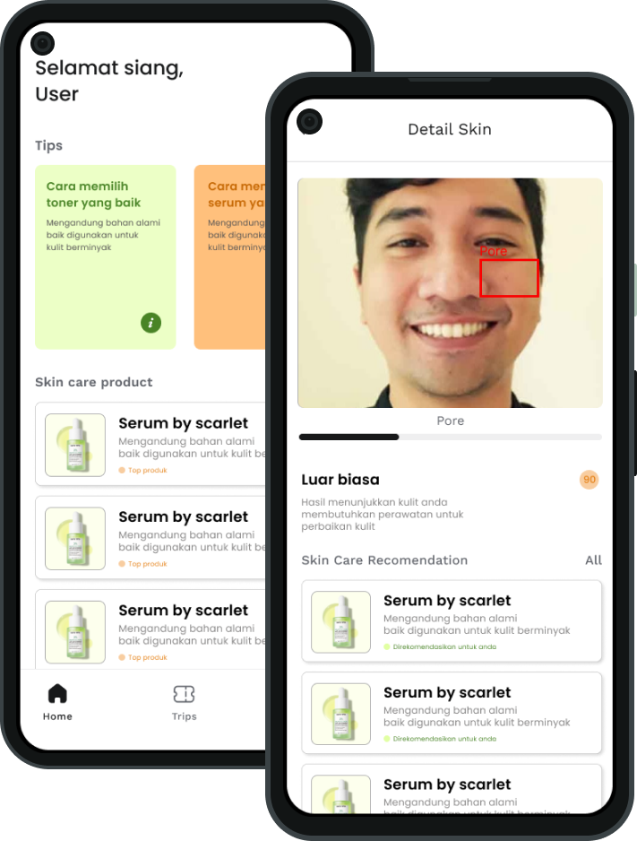
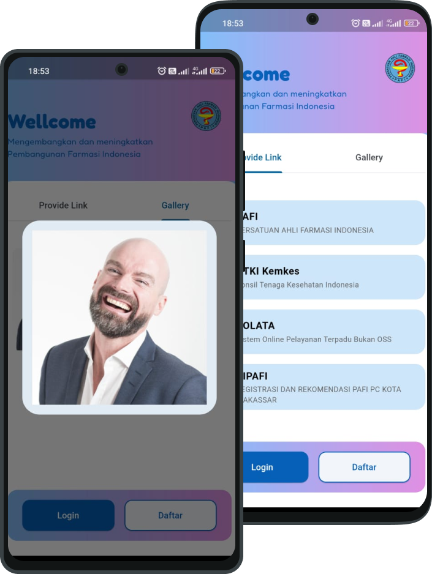

# Full Stack Developer

#### Technical Skills: Kotlin, Java, SQL, Flutter, Html, Css

## Education
- S.Tr.T., Electro | Ujung Pandang state of politechnic (_November 2023_)
- Mobile Development | Bangkit Academy led by Google, Tokopedia, Gojek, & Traveloka (_July 2023_)
- Network Computer	| The University of Texas at Dallas (_April 2019_)

## Work Experience
**Co-Founder @ Ckincheck Ai (_July 2023 - Present_)**
- Building a skincheck ai startup with a team that aims to provide a new experience for users in analyzing and improving facial skin
- Create a skincheck ai mobile application using native kotlin with the application of machine learning to detect facial skin problems and provide product recommendations
  
**Mobile Developer @ Bisa Artificial Indonesia (_Feb 2022 - Feb 2023_)**
- Build the Siakad By Bisa ai application using native kotlin as well as the project leader of the Siakad application
- Mentor of the batch 3 independent campus internship program in the field of mobile development

**Full Stack Developer @ ID Metafora Indonesia (_August 2022 - October 2023_)**
- Lead Internship as backend developer
- Building an internal Chandra Asri Petrochemical career website, Elbema company profile website

## Projects
### Mobile Application Skincheck Ai
[Publication](https://github.com/Capstone-Project-C23-PR485)

SkinCheck.AI is an All-in-One Platform For Your Skincare Needs. This project was inspired by the many teenagers in Indonesia who have acne problems and limited access to information to solve their skin problems. We took the initiative to create a mobile application that can help individuals find out the condition of their facial skin and how to care for it. We plan to create an innovative way to know the condition of the face, find suitable skin care products and the best way to treat them. We use machine learning, cloud computing, and mobile development to make these products happen.

### Mobile Application Pafi Makassar
[Publication](https://play.google.com/store/apps/details?id=com.devannas.pafimakassar)

I created a PAFI Link application as a Free application. This SERVICE is provided by RSWS Development at no cost and is intended for use as is. This application is made using the **Flutter** framework with some additional libraries

## Talks & Lectures
- Causality: The new science of an old question - GSP Seminar, Fall 2021
- Guest Lecture: Dimensionality Reduction - Big Data and Machine Learning for Scientific Discovery (PHYS 5336), Spring 2021
- Guest Lecture: Fourier and Wavelet Transforms - Scientific Computing (PHYS 5315), Fall 2020
- A Brief Introduction to Optimization - GSP Seminar, Fall 2019
- Weeks of Welcome Poster Competition - UTD, Fall 2019
- A Brief Introduction to Networks - GSP Seminar, Spring 2019

- [Data Science YouTube](https://www.youtube.com/channel/UCa9gErQ9AE5jT2DZLjXBIdA)
